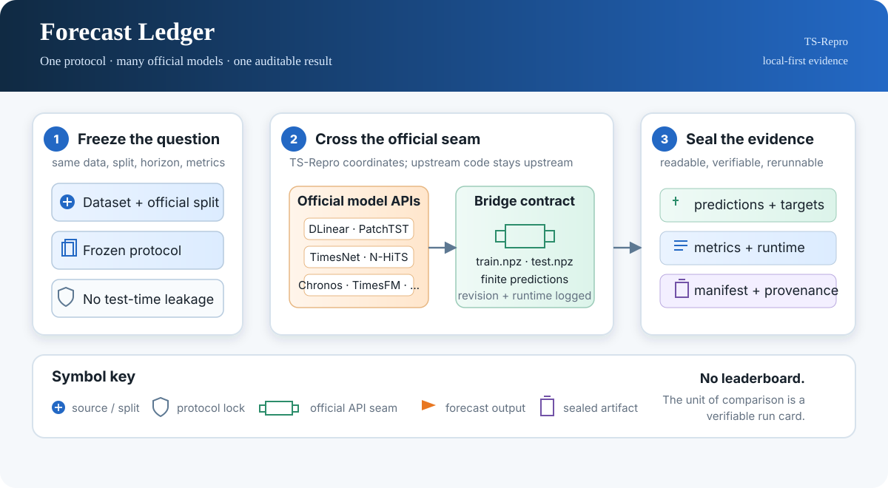

# Forecast Ledger

_TS-Repro is the stable package and CLI name._

[](https://github.com/Daerwang2020/Forecast-Ledger/actions/workflows/ci.yml) [](LICENSE) [](pyproject.toml)

**Run every official forecasting model under exactly the same experimental protocol.**

<p align="center">
  
</p>

<p align="center"><em>Figure 1. Forecast Ledger separates the scientific question from the model implementation, then turns each run into inspectable evidence.</em></p>

TS-Repro is a small, local-first toolkit for fair and reproducible time-series
forecasting evaluation. It is not a leaderboard, a new model, a benchmark, or
an audit service. It standardizes the evidence around a model while leaving the
model implementation, optimizer, checkpoints, and repository untouched.

The symbols in the figure are intentionally literal: a shield means the
protocol is locked, a plug marks the narrow official-API seam, an orange arrow
is the forecast output, and the purple document is the sealed artifact. This
keeps the homepage readable at GitHub’s default width and avoids decorative
icons that imply unsupported semantics.

Every completed run produces a sealed experiment card:

```text
experiments/
└── 20260811T103015Z_reference-linear_toy_ab12cd34/
    ├── config.yaml
    ├── dataset.json
    ├── environment.json
    ├── metrics.json
    ├── runtime.json
    ├── commit.txt
    ├── stdout.log
    ├── result.csv
    ├── report.md
    ├── predictions.npz
    └── manifest.json
```

`manifest.json` hashes every other artifact. Runs are made read-only when they
finish, and `tsr verify` detects any later modification or addition.

## What is intentionally different

Existing projects already provide valuable unified implementations and broad
benchmarks. TS-Repro deliberately does **not** copy their model code:

| Tool | What it is good at | TS-Repro choice |
| --- | --- | --- |
| [ProbTS](https://github.com/microsoft/probts) | Unified point, probabilistic, and foundation-model benchmarking | Use it directly when its implementations are the desired experimental object; do not relabel it as official-code execution. |
| [BasicTS](https://github.com/GestaltCogTeam/BasicTS) | A broad standardized benchmark library | Reuse its published dataset/model coverage as a compatibility reference, not as copied model internals. |
| [Darts](https://github.com/unit8co/darts) | General forecasting, transforms, and backtesting | Keep TS-Repro dependency-light; use Darts when a unified Darts pipeline is the research question. |

TS-Repro's narrow role is an **adapter-first protocol runner**: a model adapter
invokes an existing official checkout as an external process and must emit
validated predictions. This makes it impossible to silently substitute a
third-party reimplementation for an "official" run.

## Install

```bash
cd ts-repro
python -m pip install -e '.[dev]'
```

Or install the current public revision directly:

```bash
python -m pip install 'ts-repro @ git+https://github.com/Daerwang2020/Forecast-Ledger.git'
```

Only `numpy`, `pandas`, and `PyYAML` are required for the core. Official model
dependencies remain inside their own checkouts.

On a macOS external drive that creates `._*` AppleDouble sidecar files, build
from a staged local copy instead of packaging the mounted source directory:

```bash
scripts/build-wheel.sh /private/tmp/ts-repro-wheels
```

## A runnable five-minute example

```bash
tsr init-example ./quickstart
cd quickstart
tsr run --model reference-linear --dataset toy --output-dir experiments
tsr verify experiments/<printed-run-directory>
```

Build a local interactive evidence browser from completed cards:

```bash
tsr visualize --runs-dir experiments --output-dir viewer
python -m http.server 8000 --directory viewer
```

See [docs/index.md](docs/index.md) for the project map and
[docs/product-name.md](docs/product-name.md) for the naming and design
language.

For a clean install and API-level smoke test, use the same path as CI:

```bash
python -m pip install -e '.[dev]'
python -m pytest
```

The maintained gap audit is in [docs/project-gap-audit.md](docs/project-gap-audit.md).

`reference-linear` is a built-in deterministic sanity-check adapter. It is
clearly labelled **reference**, not an official forecasting model and not a
paper baseline.

## Data suites

Set `TS_REPRO_DATA_ROOT` to the existing LTSF data root (the current BDIC/A100
root is `/data/wzq/BDIC/data`), then the catalog contains locators for
**ETTh1/2, ETTm1/2, Electricity, Traffic, Weather, Exchange, ILI, Solar, and
PEMS03/04/07/08**. The LTSF configurations
pin the split and default horizon and reject test-time `drop_last`; all eligible
test windows are scored. Use `tsr list datasets` to inspect them before running.

GIFT-Eval is deliberately referenced, not copied. Its template instantiates
the official `gift_eval.data.Dataset` using `GIFT_EVAL`, then maps the official
`training_dataset`, `validation_dataset`, and paired `test_data.input` /
`test_data.label` objects into the manifest. Install the official package in
the active environment and copy `gift-eval-template.yaml` with a concrete
dataset name.

To compare any already configured adapters:

```bash
tsr compare reference-linear another-model --dataset toy --output-dir experiments
```

The command prints a sealed comparison directory containing `comparison.csv`,
`comparison.md`, `comparison.tex`, `comparison.json`, and its own manifest.

## Official-model workflow

1. Clone the model's official repository at a chosen revision.
2. Copy a template from `ts_repro/catalog/models/` and set `repository_dir`,
   `official_revision`, any official checkpoint, and the two commands.
3. Add a tiny bridge script *beside* the official repository or use its native
   CLI. The bridge reads TS-Repro's documented `.npz` exchange files and writes
   `predictions.npz`; it must not edit model source files.
4. Run `tsr run --model path/to/model.yaml --dataset ...`.

The runner records the checkout's actual Git revision, command, return codes,
standard output, checkpoint digest (when supplied), dataset digest, exact
effective configuration, seed, environment, timing, and peak CUDA allocation.
An official command adapter refuses to run if the required provenance fields or
prediction contract are missing.

See [docs/official-adapters.md](docs/official-adapters.md) for the bridge
contract, and [docs/protocol.md](docs/protocol.md) for the exact split and
normalization rules.
The latest interface-gate evidence is recorded in
[docs/bridge-verification.md](docs/bridge-verification.md).

The production bridge architecture and 22-model closure matrix are in
[docs/production-bridges.md](docs/production-bridges.md). The bridge invokes
the official checkout or package; it does not copy or silently replace it.

The P0/P1/P2 model panel and its admission gate are in [docs/model-roadmap.md](docs/model-roadmap.md).
Pinned upstream revisions and checkout/bridge status are tracked in
[docs/model-bindings.md](docs/model-bindings.md).

## Commands

```text
tsr list datasets
tsr list models
tsr doctor all
tsr init-example DIRECTORY
tsr run --model MODEL --dataset DATASET [--mode supervised|zero-shot|fine-tune]
tsr compare MODEL [MODEL ...] --dataset DATASET
tsr verify RUN_OR_COMPARISON_DIRECTORY
tsr visualize --runs-dir RUNS_DIRECTORY --output-dir VIEWER_DIRECTORY
```

`MODEL` and `DATASET` may be a catalog name or a YAML path. Additional catalog
locations can be given with `--models-dir` and `--datasets-dir`.

To exercise all 22 bridge boundaries without loading optional research stacks,
use the explicit unit-test fixture gate (with the official checkout root and
bridge root exported):

```bash
TS_REPRO_MODEL_ROOT=/data/wzq/BDIC/ts-repro-checkouts \
TS_REPRO_BRIDGE_ROOT=$PWD/bridges \
python scripts/verify_model_bridges.py --output-dir bridge-verification
```

This writes one sealed run per model. It sets `TS_REPRO_TEST_MODE=1`; those
fixtures test process, persistence, and shape handling only. Production runs
must omit that variable and use the pinned official runtime/checkpoint.

`tsr doctor all` is a read-only preflight: it attempts each dataset loader and
validates every model configuration, but it never starts training or downloads
anything. Use it after setting `TS_REPRO_DATA_ROOT` and after adding official
checkouts/bridges to distinguish a missing local resource from an interface
failure.

## Scope of v0.1

v0.1 ships the protocol, manifest machinery, reports, a runnable reference
adapter, pinned P0/P1/P2 bindings, and production API bridges for all 22 rows.
Scientific tables still require the full dataset's original-series mapping,
official split, exact runtime lock, and sealed evidence; a successful NPZ
closure alone is an interface result, not a paper claim.

## Contributing

Please add a model through an official command adapter, pin the upstream
revision, document the command and output mapping, and include an end-to-end
test using a small public fixture. Never commit downloaded datasets, model
weights, or unverified result tables. See [CONTRIBUTING.md](CONTRIBUTING.md),
[CODE_OF_CONDUCT.md](CODE_OF_CONDUCT.md), [SECURITY.md](SECURITY.md), and
[CITATION.cff](CITATION.cff) before opening a change.
