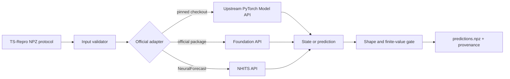

# Production bridge architecture

The 22 catalog entries now share one production bridge implementation in
`bridges/official_bridge.py`. Each model wrapper only selects a model name; it
does not contain a substitute forecaster.

The Module/Interface seam is deliberately narrow: the runner supplies
`train.npz`, `test.npz`, and `protocol.json`; the Adapter returns a finite
`predictions.npz` with the exact required shape. The Implementation remains in
the official checkout or package. This gives high leverage without copying
model code, and keeps locality of failures: a missing optional runtime or an
upstream constructor mismatch is reported by the named model rather than
silently repaired by a generic baseline.

## Adapter inventory

| Models | Official implementation seam | Runtime | Real closure |
| --- | --- | --- | --- |
| DLinear, PatchTST, iTransformer, TimeMixer, TimesNet | pinned upstream `Model` class | PyTorch | verified on A100 |
| PDF, xPatch, Amplifier, TimeBridge, TimeKAN, SparseTSF, Pathformer | pinned upstream `Model` class | PyTorch | verified on A100 |
| FITS | pinned upstream `models.FITS.Model` class | PyTorch | API path implemented; prior official CLI closure, A100 API replay pending |
| PatchMLP, DUET | DUET benchmark's upstream baseline classes | PyTorch | verified on A100 |
| N-HiTS | `neuralforecast.models.NHITS` | NeuralForecast/Lightning, single CPU process for bridge closure | verified on A100 |
| Chronos-2 | `Chronos2Pipeline.predict_df` | Chronos package + local checkpoint | verified locally |
| TimesFM 2.5 | `TimesFM_2p5_200M_torch.forecast` after official `compile` | TimesFM package + local checkpoint | verified locally |
| Moirai-2 | `Moirai2Module.forward` with official patch/mask protocol | uni2ts + local checkpoint | verified locally |
| TTM | `TinyTimeMixerForPrediction` | `tsfm_public` + local checkpoint | verified locally |
| Time-MoE, Timer | `AutoModelForCausalLM.generate` with pinned remote code | Transformers 4.40.1 / tokenizers 0.19.1 | verified in pinned runtime |

Production mode has no ridge, persistence, or linear-continuation fallback.
`TS_REPRO_TEST_MODE=1` exists only for dependency-free unit tests and is never
used by catalog runs.

## Reference repositories

TS-Repro borrows proven repository boundaries rather than copying their model
implementations:

- [Time-Series-Library](https://github.com/thuml/Time-Series-Library) is the
  broad official model library and CLI family used for the TSLib-compatible
  adapters.
- [TFB](https://github.com/decisionintelligence/TFB) is the fairness and
  dataset-coverage reference; its scripts make preprocessing and `drop_last`
  choices explicit.
- [ProbTS](https://github.com/microsoft/ProbTS) is the probabilistic and
  foundation-model integration reference, especially for checkpoint/API
  handling and GIFT-Eval compatibility.
- [BasicTS](https://github.com/GestaltCogTeam/BasicTS) remains a useful
  standardized benchmark reference for dataset/model coverage.

These projects are references and optional integrations. TS-Repro continues to
record the upstream revision, runtime, checkpoint digest, command/API, and
output mapping in each sealed run instead of presenting a copied implementation
as official code.
