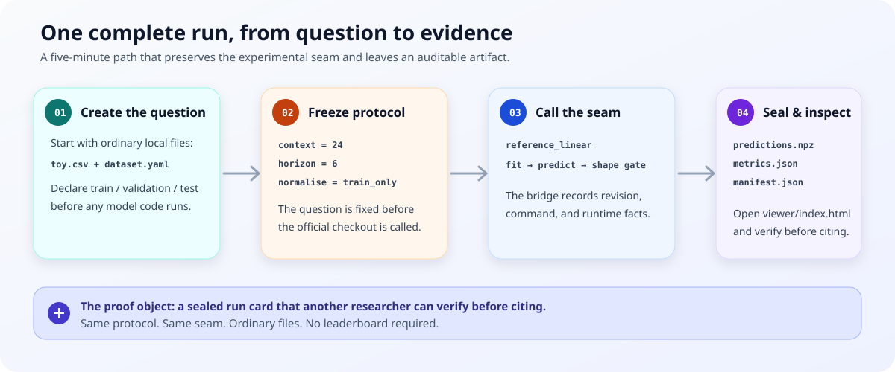

# Canonical case study

This is the smallest complete Forecast Ledger run. It creates a deterministic
toy series, loads a local dataset and model catalog, crosses the same narrow
`fit → predict → shape gate` seam used by official bridges, seals the outputs,
and opens them in the evidence viewer. Nothing is downloaded and no GPU is
needed.



## Run it

```bash
cd ts-repro
python -m pip install -e .
PYTHONPATH=. python examples/quickstart.py --output-dir /tmp/forecast-ledger-demo
python -m http.server 8000 --directory /tmp/forecast-ledger-demo/viewer
```

Open <http://localhost:8000> to inspect the run card, metrics, prediction
preview, and manifest status. The `reference-linear` adapter is deliberately a
sanity check, not a paper baseline.

## The equivalent CLI path

```bash
tsr init-example /tmp/forecast-ledger-quickstart
tsr run \
  --model /tmp/forecast-ledger-quickstart/models/reference-linear.yaml \
  --dataset /tmp/forecast-ledger-quickstart/datasets/toy.yaml \
  --output-dir /tmp/forecast-ledger-quickstart/experiments
tsr visualize \
  --runs-dir /tmp/forecast-ledger-quickstart/experiments \
  --output-dir /tmp/forecast-ledger-quickstart/viewer
```

The generated directory is intentionally inspectable: the CSV, YAML protocol,
JSON metadata, NPZ predictions, and `manifest.json` are all ordinary local
files. That makes this case useful in tutorials, issue reports, and pull
requests without shipping model weights or private data.
